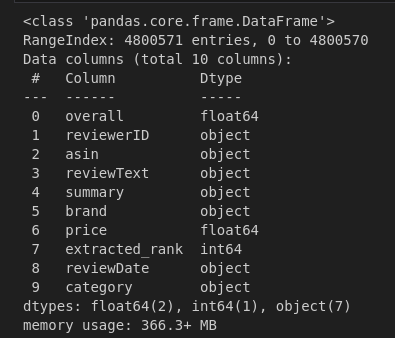

# README - Proyecto de Ciencia en Datos

Este repositorio contiene el material y resultados asociados al proyecto del curso de **Seminario** de la Especialización en Analítica y Ciencia de Datos de la Universidad de Antioquia, sede Medellín, correspondiente a la Cohorte 5 del año 2023. El objetivo final de este proyecto es la elaboración de una propuesta monográfica.

**Tema:** *Desarrollo y Evaluación de Sistemas de Recomendación Con Análisis de sentimientos para la Optimización de Ventas en el Mercado Online: Un Enfoque Analítico de Datos.*

## Integrantes
- Lina Beltrán - linam.beltran@udea.edu.co
- Mario Otero - mario.otero@udea.edu.co

## Objetivo del curso

El objetivo de este curso es desarrollar habilidades en la aplicación de fundamentos metodológicos y conceptuales para la identificación y formulación de proyectos de investigación aplicada en el campo de la analítica y ciencia de datos. Además, se busca explorar consideraciones prácticas de conceptos de analítica de datos en proyectos aplicados, así como promover la elaboración y presentación de una propuesta monográfica.

## Objetivo del proyecto

El objetivo general de esta investigación es concebir, desarrollar y evaluar sistemas de
recomendación, empleando análisis de sentimientos como componente adicional al de los
modelos tradicionales de este tipo de sistemas. El propósito se centra en ofrecer a la industria
e-commerce un respaldo a sus estrategias comerciales basado en técnicas analíticas y de
aprendizaje automático para el comercio en línea. La delimitación temporal de esta indagación
abarca desde el año 1996 hasta el año 2018 y se fundamenta en la exploración de conjuntos de
datos de reseñas de productos proporcionados por Amazon.


## Caso de estudio

Este proyecto se enmarca en el contexto del comercio electrónico, donde las empresas buscan constantemente formas de mejorar sus estrategias de ventas en línea. En particular, se aborda el desafío de optimizar las ventas en un mercado con alta variabilidad e incertidumbre, utilizando como fuente de datos reseñas de productos proporcionados por la plataforma Amazon durante un periodo aproximado de 22 años.

Este fue tomado de: [Amazon Review Data (2018)](https://cseweb.ucsd.edu/~jmcauley/datasets/amazon_v2/#complete-data)


## Información de atributos

### Conjunto de datos de reseñas de productos de Amazon

- reviewerID - ID del revisor, por ejemplo, A2SUAM1J3GNN3B.
- asin - ID del producto, por ejemplo, 0000013714.
- reviewerName - nombre del revisor.
- vote - votos útiles de la revisión.
- style - un diccionario de metadatos del producto, por ejemplo, "Formato" es "Tapa dura".
- reviewText - texto de la revisión.
- overall - calificación del producto.
- summary - resumen de la revisión.
- unixReviewTime - tiempo de la revisión (tiempo Unix).
- reviewTime - tiempo de la revisión (sin procesar).
- image - imágenes que los usuarios publican después de haber recibido el producto.

### Conjunto de datos de metadatos de productos de Amazon

- asin - ID del producto, por ejemplo, 0000031852.
- title - nombre del producto.
- feature - características del producto en formato de viñetas.
- description - descripción del producto.
- price - precio en dólares estadounidenses (al momento de la extracción).
- imageURL - URL de la imagen del producto.
- imageURL - URL de la imagen de alta resolución del producto.
- related - productos relacionados (también comprados, también vistos, comprados juntos, comprar después de ver).
- salesRank - información de clasificación de ventas.
- brand - nombre de la marca.
- categories - lista de categorías a las que pertenece el producto.
- tech1 - la primera tabla de detalles técnicos del producto.
- tech2 - la segunda tabla de detalles técnicos del producto.
- similar - tabla de productos similares.


## Caracteríticas del dataset

- RangeIndex: 4800571 entries, 0 to 4800570
- Data columns (total 10 columns):
- dtypes: float64(2), int64(1), object(7)
- shape: (4800571, 10)




## Instrucciones de uso

**Para utilizar el código y los datos de este proyecto DE MANERA LOCAL, siga los siguientes pasos:**

1. Clone este repositorio en su máquina local.
2. Asegúrese de tener instalado Python 3 y las bibliotecas necesarias mencionadas en el archivo de requisitos "requirements.txt" ubicado en el folder "Ejecutables". Puede usar este archivo para instalar los recursos en su maquina local, con el siguiente comando `pip install -r requirements.txt`
3. Ejecute el archivo principal del proyecto ubicado en el folder "Ejecutables" utilizando el intérprete de Python.

```bash

python main.py

```

4. Siga las instrucciones presentadas en la interfaz para interactuar con el proyecto y analizar los datos.

**Para utilizar el código y los datos de este proyecto DE MANERA ONLINE, siga los siguientes pasos:**

1. Para ejecutar el script/notebook 1 ingrese a este link: [iteracion1ML.ipynb](https://github.com/lmbd92/DataScienceMonograph/blob/main/Notebooks/iteracion1ML.ipynb) para el script/notebook 2 ingrese a este link: [iteracion2ML.ipynb](https://github.com/lmbd92/DataScienceMonograph/blob/main/Notebooks/iteracion2ML.ipynb)
2. Haga click en el ícono "open in Colab" ubicado en la cabecera del archivo
3. En el menú de Colab despliegue la opción "Entorno de ejecución" y seguidamente seleccione la opción "Ejecutar todas" / ctrl +F9 (ver imagen)


## Contribución

Si desea contribuir a este proyecto, siga los siguientes pasos:

1. Realice un fork de este repositorio.
2. Cree una rama para su nueva característica (`git checkout -b feature/nueva-caracteristica`).
3. Realice los cambios necesarios y agregue los archivos modificados (`git add`).
4. Realice un commit de sus cambios (`git commit -m 'Agregada nueva característica'`).
5. Haga push de los cambios a la rama (`git push origin feature/nueva-caracteristica`).
6. Abra una solicitud de extracción en este repositorio.

Agradecemos cualquier contribución y estaremos encantados de revisar y fusionar las solicitudes de mejoras


## Licencia

Este proyecto se encuentra bajo la Licencia MIT.
